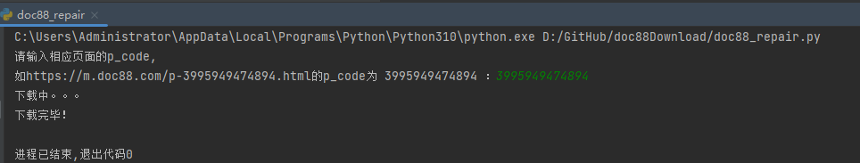

# doc88Download

## 修改点1

- 设置http/https不使用系统代理

```sh
#23
result = requests.get(url, headers=header, proxies={"http": None, "https": None})

#130
result = requests.get(gif_url, proxies={"http": None, "https": None})
```

## 修改点2

- 图片合并为pdf

```sh
#141
pdfbytes = imgdoc.convert_to_pdf()  # 使用图片创建单页的 PDF

#143
doc.insert_pdf(imgpdf)  # 将当前页插入文档
```

## 使用方法

- 从url中获得p_code，运行doc88_repair.py，输入p_code即可。


